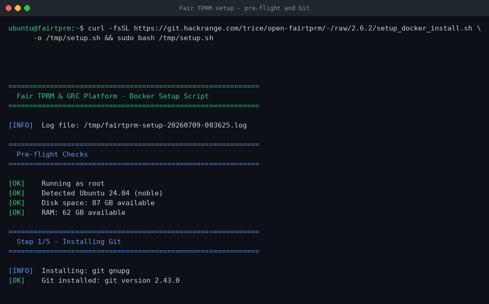
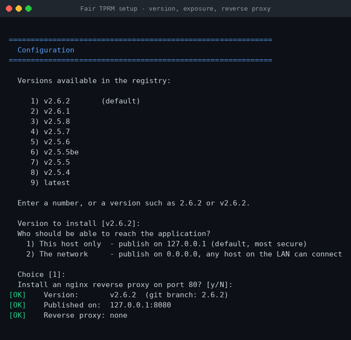
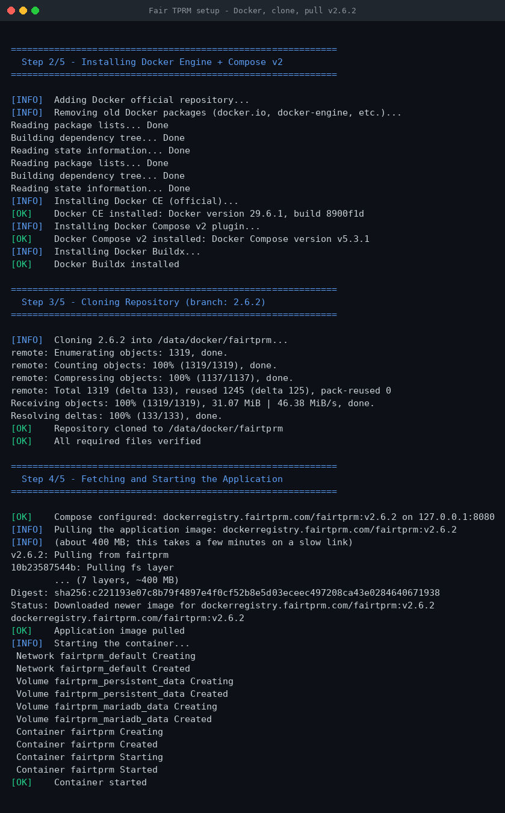
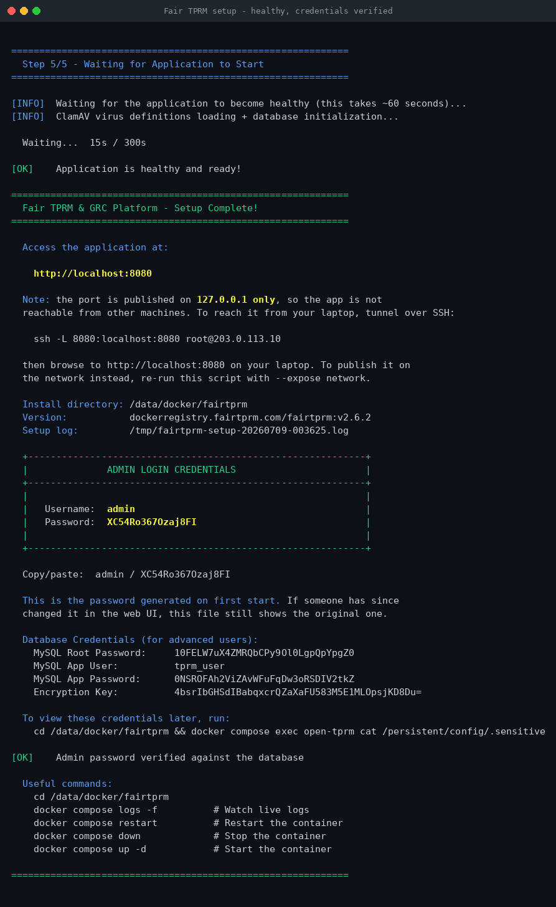
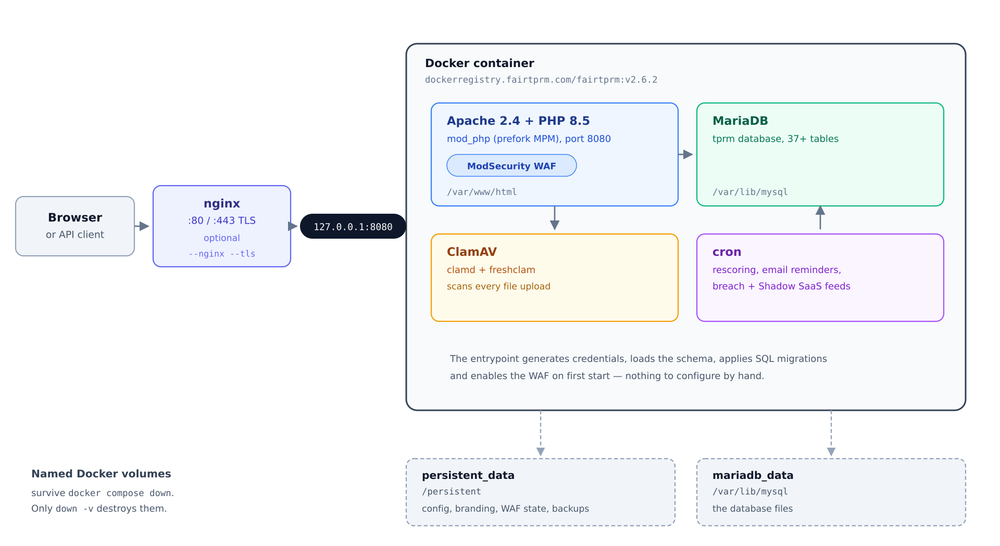

# Fair TPRM & GRC Platform v2.6.2

Third-Party Risk Management and Governance, Risk & Compliance platform with
FAIR (Factor Analysis of Information Risk) quantitative analysis. Built on
PHP 8.5, Apache 2.4, MariaDB, ClamAV, and ModSecurity (WAF).

**Author:** Tim Rice — Hack Range
**Disclaimer:** Use this software at your own risk. No warranty provided.

---

## Try It Free - No Installation Required

Want to see Fair TPRM & GRC in action before installing anything? A **free
hosted trial** is available at
[FairTPRM.com](https://fairtprm.com) with **AI-assisted analysis** and
**Shodan integration** already configured and ready to use. No setup, no
Docker, no servers - just sign up and start managing your vendor risk program
immediately.

**Dedicated SaaS Hosting:** For organizations that prefer a fully managed,
dedicated SaaS tenant hosted by FairTPRM.com, hosting plans are available.
All proceeds go towards **educating tomorrow's cybersecurity experts** and
covering infrastructure costs.

Visit [FairTPRM.com](https://fairtprm.com) to get started.

---

## Table of Contents

1. [What Is This?](#what-is-this)
2. [One-Command Setup (Fastest)](#one-command-setup-fastest)
   - [Step 1 — Pre-flight, then Git](#step-1--pre-flight-then-git)
   - [Step 2 — Choose a version, exposure and reverse proxy](#step-2--choose-a-version-exposure-and-reverse-proxy)
   - [Step 3 — Install Docker, clone, and pull the image](#step-3--install-docker-clone-and-pull-the-image)
   - [Step 4 — Wait for health, then read your credentials](#step-4--wait-for-health-then-read-your-credentials)
   - [Running it unattended](#running-it-unattended)
3. [Features](#features)
4. [Architecture](#architecture)
5. [Getting the Code](#getting-the-code)
   - [Install Git](#install-git)
   - [Clone the Repository](#clone-the-repository)
6. [Option A — Docker Deployment (Recommended)](#option-a--docker-deployment-recommended)
   - [What You Need](#what-you-need-docker)
   - [Quick Start](#quick-start)
   - [What Happens on First Start](#what-happens-on-first-start)
   - [Getting Your Login Credentials](#getting-your-login-credentials)
   - [Image and Run Options](#image-and-run-options)
   - [Volumes and Persistence](#volumes-and-persistence)
   - [Stopping, Restarting, and Upgrading](#stopping-restarting-and-upgrading)
7. [Option B — Manual Installation on Ubuntu 22.04](#option-b--manual-installation-on-ubuntu-2204)
   - [What You Need](#what-you-need-manual)
   - [Step 1 — Install System Packages](#step-1--install-system-packages)
   - [Step 2 — Add the PHP 8.5 Repository](#step-2--add-the-php-85-repository)
   - [Step 3 — Install PHP, Apache, MariaDB, and ClamAV](#step-3--install-php-apache-mariadb-and-clamav)
   - [Step 4 — Set Up MariaDB and Generate Credentials](#step-4--set-up-mariadb-and-generate-credentials)
   - [Step 5 — Create the Database and Load the Schema](#step-5--create-the-database-and-load-the-schema)
   - [Step 6 — Copy the Application Files](#step-6--copy-the-application-files)
   - [Step 7 — Install PHP Dependencies (Composer)](#step-7--install-php-dependencies-composer)
   - [Step 8 — Configure the Application](#step-8--configure-the-application)
   - [Step 9 — Harden PHP](#step-9--harden-php)
   - [Step 10 — Configure Apache](#step-10--configure-apache)
   - [Step 11 — Set Up ModSecurity (WAF)](#step-11--set-up-modsecurity-waf)
   - [Step 12 — Set Up ClamAV Antivirus](#step-12--set-up-clamav-antivirus)
   - [Step 13 — Install Cron Jobs](#step-13--install-cron-jobs)
   - [Step 14 — Set Directory Permissions](#step-14--set-directory-permissions)
   - [Step 15 — Seed the Database](#step-15--seed-the-database)
   - [Step 16 — Enable and Start Services](#step-16--enable-and-start-services)
   - [Step 17 — (Optional) Set Up a Reverse Proxy with Nginx + TLS](#step-17--optional-set-up-a-reverse-proxy-with-nginx--tls)
   - [Step 18 — Log In for the First Time](#step-18--log-in-for-the-first-time)
8. [Directory Structure](#directory-structure)
9. [How the Docker Entrypoint Works](#how-the-docker-entrypoint-works)
10. [SQL Migrations](#sql-migrations)
11. [Cron Jobs Reference](#cron-jobs-reference)
12. [Integrations](#integrations)
13. [Security Notes](#security-notes)
14. [Troubleshooting](#troubleshooting)

---

## What Is This?

Fair TPRM & GRC is a **self-hosted** web application for managing third-party
vendor risk and compliance programs. Think of it as your organization's command
center for:

- Tracking which vendors you work with and how risky they are
- Running quantitative FAIR risk analyses (Monte Carlo simulations)
- Managing compliance frameworks (NIST, ISO 27001, SOC 2, PCI DSS, etc.)
- Monitoring for data breaches and security issues
- Generating PDF reports for leadership and auditors

Everything runs inside a single server (or Docker container) — there are no
external dependencies besides optional API integrations (UpGuard, Shodan, etc.).

The **Docker deployment** is the fastest way to get started. It packages
everything (Apache, PHP, MariaDB, ClamAV, ModSecurity) into one container that
auto-configures itself on first launch. The **manual installation** gives you
full control and is better for production servers you want to manage yourself.

---

## One-Command Setup (Fastest)

If you have a fresh **Ubuntu 22.04**, **24.04** or **26.04** server and just want
to get up and running as fast as possible, run this single command. It installs
everything (Git, Docker, Docker Compose), clones the repository to
`/data/docker/fairtprm`, pulls the published `v2.6.2` image, and starts the
application:

```bash
curl -fsSL https://git.hackrange.com/trice/open-fairtprm/-/raw/2.6.2/setup_docker_install.sh -o /tmp/setup.sh && sudo bash /tmp/setup.sh
```

Or, if you already have the repository cloned:

```bash
sudo ./setup_docker_install.sh
```

Nothing is compiled on your machine: the application image is published
pre-built and the script simply pulls it.

#### Step 1 — Pre-flight, then Git

The script checks that you are root, on a supported Ubuntu release, and have at
least 5 GB of disk and 2 GB of RAM. It then installs Git (plus `curl` and
`gnupg`, which the later steps need):



#### Step 2 — Choose a version, exposure and reverse proxy

Next it asks three questions, each with a safe default you can accept by
pressing Enter:

1. **Which version?** It lists the tags published in the registry. Enter a
   number, or type `2.6.2` — a leading `v` is optional, so `2.6.2` and `v2.6.2`
   both install `v2.6.2`. Default: `v2.6.2`.
2. **Who can reach it?** `127.0.0.1` only (default), or the whole network.
3. **Install an nginx reverse proxy?** Default: no.



#### Step 3 — Install Docker, clone, and pull the image

It installs Docker Engine and Compose v2 from Docker's official repository,
clones the `2.6.2` branch to `/data/docker/fairtprm`, and pulls the `v2.6.2`
image (about 400 MB) from `dockerregistry.fairtprm.com`:



#### Step 4 — Wait for health, then read your credentials

The container initializes MariaDB, loads the schema and starts ClamAV, Apache
and cron. This takes about a minute. When the health check passes, the script
prints your auto-generated admin credentials — and verifies them against the
database before showing them to you:



> The password shown is the one generated on **first start**. If it has since
> been changed in the web UI, the file still holds the original — that is why
> the script checks it against the database and tells you when the two
> disagree. See [Forgot the admin password](#forgot-the-admin-password).

#### Running it unattended

Every answer is also a command-line option, so the script can run without a
terminal:

| Option | What it does |
|--------|--------------|
| `-v, --version TAG` | Version to install. `2.6.2` and `v2.6.2` both mean `v2.6.2`. Default `v2.6.2` |
| `-e, --expose MODE` | `host` publishes on `127.0.0.1` (default); `network` publishes on `0.0.0.0` |
| `-p, --port PORT` | Host port to publish. Default `8080` |
| `--nginx` / `--no-nginx` | Install an nginx reverse proxy on port 80. Default: no |
| `-d, --domain FQDN` | `server_name` for the nginx site |
| `--tls` / `--email ADDR` | Request a Let's Encrypt certificate (needs `--domain`) |
| `-y, --yes` | Never prompt; take the defaults for anything not given |
| `-h, --help` | Show the full help |

```bash
# No prompts: v2.6.2, port 8080 on 127.0.0.1, no reverse proxy
sudo ./setup_docker_install.sh --yes

# Reachable from every host on the LAN (plain HTTP -- see the warning below)
sudo ./setup_docker_install.sh --expose network

# Install the previous v2.6.1 release instead
sudo ./setup_docker_install.sh --version 2.6.1

# Serve it over HTTPS through nginx, keeping the app itself on 127.0.0.1
sudo ./setup_docker_install.sh --nginx --domain tprm.example.com --tls --email you@example.com
```

When the script has no terminal to prompt on — `curl ... | bash`, cloud-init,
Ansible — it silently uses the defaults: **`v2.6.2`, port 8080 on `127.0.0.1`,
no reverse proxy.**

> **Why can't other machines reach port 8080?** By default the port is published
> on `127.0.0.1`, so only the server itself can connect. This is deliberate: the
> app speaks plain HTTP. Reach it over an SSH tunnel
> (`ssh -L 8080:localhost:8080 user@your-server`), re-run with `--expose network`
> to publish it on `0.0.0.0`, or put it behind TLS with `--nginx --domain ... --tls`.
> Note that a published Docker port is inserted ahead of UFW's rules, so
> `--expose network` reaches the LAN even when `ufw` claims to deny it.

> **Prefer to do it step by step?** Skip to [Getting the Code](#getting-the-code)
> for the manual walkthrough.

---

## Features

- **FAIR Analysis** — Quantitative risk modeling with Monte Carlo simulation
- **Vendor Onboarding** — Intake workflows with stakeholder assignments and approvals
- **Vendor Assessments** — Configurable assessment templates (ISO 27001, Tier 2, custom)
- **Security Rating Scores (SRS)** — UpGuard and Shodan integration for continuous scoring
- **Annual Reviews** — Automated review cycles with email reminders
- **GRC Frameworks** — Pre-seeded catalog: NIST CSF, NIST 800-171, ISO 27001, SOC 2, PCI DSS, CMMC, SOX
- **GRC Controls, Risks, Gaps, Policies, Audits, Tasks, Evidence** — Full compliance lifecycle
- **GRC Assessments** — Unified question bank with framework-mapped assessments
- **Fourth-Party Risk** — Technology inventory tracking across vendor supply chains
- **Breach Alerts** — Automated breach monitoring with OSINT-driven discovery
- **Shadow SaaS Discovery** — Identify unauthorized SaaS usage with risk scoring and onboarding workflows
- **Grip Security Integration** — Sync discovered SaaS apps, users, and alerts from Grip Security into the Shadow SaaS inventory (scheduled rehydration + on-demand "Run Now")
- **Zscaler Enforcement** — Block unsanctioned SaaS domains directly in Zscaler Internet Access (ZIA) from the Shadow SaaS "Deny" action
- **Procurement Contracts** — Contract tracking with expiry reminders
- **Cyber Todo** — Task and activity tracking
- **SCIM v2 Provisioning** — Automated user provisioning from identity providers
- **SAML 2.0 SSO** — Single sign-on via Okta, Azure AD/Entra, or any SAML 2.0 IdP, validated with the battle-tested `onelogin/php-saml` library; supports an optional SAML-only mode with a break-glass local admin login
- **Role-Based Access Control** — Granular ACL with groups and permissions, including a read-only Auditor role enforced server-side
- **ModSecurity WAF** — Built-in web application firewall with learning/enforcing modes and a positive-security lockdown whitelist
- **ClamAV Scanning** — Antivirus scanning on all file uploads
- **PDF Reports** — Downloadable PDF reports via dompdf
- **Email Notifications** — SMTP **or** Microsoft 365 Graph API delivery, with configurable templates
- **AI-Assisted Analysis** — Optional OpenWebUI/LibreChat (LLM) integration for AI-generated FAIR risk analysis, vendor enrichment, and AI risk indicators on vendor records

---

## Architecture

Everything runs in a **single container** — web server, database, antivirus and
scheduler — with two named volumes for state. There is nothing to wire together:



| Component | What It Does |
|-----------|-------------|
| **Apache 2.4** | Web server — serves PHP via `mod_php` (prefork MPM) on port 8080 |
| **PHP 8.5** | Application runtime with extensions: curl, gd, mbstring, mysql, xml, xsl, zip, intl, sqlite3 |
| **MariaDB** | Relational database (data stored on a named volume so it survives restarts) |
| **ClamAV** | Antivirus daemon — scans every file upload for malware |
| **ModSecurity** | Web Application Firewall — blocks common attacks (SQL injection, XSS, scanners) |
| **Cron** | Runs scheduled background jobs (rescoring, email reminders, breach monitoring) |
| **nginx** *(optional)* | Reverse proxy for TLS on ports 80/443; installed by `setup_docker_install.sh --nginx` |

| Volume | Mounted at | Holds |
|--------|-----------|-------|
| `persistent_data` | `/persistent` | Config, branding, WAF state, DB backups, migration tracking |
| `mariadb_data` | `/var/lib/mysql` | The MariaDB database files |

> The port is published on `127.0.0.1:8080` by default, so only the server
> itself can reach it. See
> [Choosing a version, network exposure and a reverse proxy](#step-2--choose-a-version-exposure-and-reverse-proxy).

---

## Getting the Code

Before you can deploy the application (via Docker or manually), you need to
download the source code to your machine. The easiest way is with **Git**.

### Install Git

If you don't already have Git installed, run:

**Ubuntu / Debian:**

```bash
sudo apt-get update
sudo apt-get install -y git
```

**macOS (with Homebrew):**

```bash
brew install git
```

**Windows:**

Download and install from [git-scm.com](https://git-scm.com/download/win),
or if you have [winget](https://learn.microsoft.com/en-us/windows/package-manager/winget/):

```powershell
winget install Git.Git
```

Verify Git is installed:

```bash
git --version
# Expected output: git version 2.x.x
```

### Clone the Repository

Now download the project files to your machine:

```bash
# Navigate to where you want to store the project (e.g., your home directory)
cd ~

# Clone the repository and check out the v2.6.2 stable branch
git clone -b 2.6.2 https://git.hackrange.com/trice/open-fairtprm.git

# Move into the project directory
cd open-fairtprm
```

> **What does `git clone` do?** It downloads a complete copy of the project
> files from the server to your computer. You only need to do this once.
> To get updates later, run `git pull` from inside the project directory.
> The `-b 2.6.2` flag checks out the current stable v2.6.2 line; `master` now
> points to the same release, so omitting the flag gives you the same code.

You should now see files like `Dockerfile`, `docker-compose.yml`, `README.md`,
and the `web/` and `docker/` directories:

```bash
ls -la
```

You are now ready to deploy. Choose one of the two options below:

- **Option A (Docker)** — Fastest, fully automated, recommended for most users
- **Option B (Manual)** — Full control, better for production servers you manage yourself

---

## Option A — Docker Deployment (Recommended)

This is the **easiest way to get started**. One command pulls the pre-built
image and auto-configures the database, credentials, and WAF.

### What You Need (Docker)

| Requirement | Minimum |
|-------------|---------|
| **Git** | Any recent version ([install instructions above](#install-git)) |
| **Docker Engine** | Version 20.10 or newer |
| **Docker Compose** | v2 (comes bundled with Docker Desktop; on Linux install `docker-compose-plugin`) |
| **RAM** | 2 GB (ClamAV loads ~1 GB of virus definitions into memory) |
| **Disk** | 5 GB (for the Docker image + database + virus definitions) |
| **Network** | Outbound HTTPS to `dockerregistry.fairtprm.com` to pull the image |

> **Don't have Docker installed?** On any supported Ubuntu release, run these
> commands (`$(lsb_release -cs)` fills in your release codename automatically):
>
> ```bash
> # Remove any old Docker packages
> sudo apt-get remove -y docker docker-engine docker.io containerd runc 2>/dev/null || true
>
> # Install prerequisites
> sudo apt-get update
> sudo apt-get install -y ca-certificates curl gnupg
>
> # Add Docker's official GPG key and repository
> sudo install -m 0755 -d /etc/apt/keyrings
> curl -fsSL https://download.docker.com/linux/ubuntu/gpg | sudo gpg --dearmor -o /etc/apt/keyrings/docker.gpg
> sudo chmod a+r /etc/apt/keyrings/docker.gpg
> echo "deb [arch=$(dpkg --print-architecture) signed-by=/etc/apt/keyrings/docker.gpg] https://download.docker.com/linux/ubuntu $(lsb_release -cs) stable" \
>     | sudo tee /etc/apt/sources.list.d/docker.list > /dev/null
>
> # Install Docker Engine and Compose
> sudo apt-get update
> sudo apt-get install -y docker-ce docker-ce-cli containerd.io docker-compose-plugin
>
> # (Optional) Let your user run Docker without sudo
> sudo usermod -aG docker $USER
> # Log out and back in for this to take effect
> ```
>
> Verify with: `docker --version` and `docker compose version`

### Quick Start

> **Want to skip all the manual steps?** The [setup_docker_install.sh](#one-command-setup-fastest)
> script does everything below automatically with a single command.

If you haven't already, [clone the repository](#clone-the-repository) first.
Then:

```bash
# 1. Navigate to the project directory
cd ~/open-fairtprm

# 2. Pull the published image and start the container (runs in the background)
docker compose pull
docker compose up -d

# 3. Watch the startup logs (first start takes ~60 seconds)
docker compose logs -f
```

When you see `==> Starting Apache on port 8080...` in the logs, the application
is up. Press `Ctrl+C` to stop watching logs (the container keeps running).

Confirm it is healthy and reachable:

```bash
docker compose ps
# NAME      IMAGE                                         STATUS                   PORTS
# fairtprm  dockerregistry.fairtprm.com/fairtprm:v2.6.2   Up 2 minutes (healthy)   127.0.0.1:8080->8080/tcp

curl -o /dev/null -w '%{http_code}\n' http://localhost:8080/login.php   # -> 200
```

The application is now at **http://localhost:8080**.

> **Do not run `docker compose build`.** The `Dockerfile` overlays files from
> `persistent/`, which is not part of this repository, so a build fails with
> `"/persistent/icons": not found`. The image is published pre-built — pull it.

### What Happens on First Start

You don't need to do any of this manually — the container does it all
automatically:

1. Creates the `/persistent` volume with default config and branding files
2. Starts MariaDB and generates random, secure passwords
3. Creates the `tprm` database and loads the full schema (37+ tables)
4. Applies all SQL migration files
5. Seeds GRC framework catalogs (NIST CSF, ISO 27001, SOC 2, PCI DSS, CMMC, SOX, NIST 800-171)
6. Seeds the unified assessment question bank
7. Initializes the WAF in enforcing mode
8. Starts ClamAV (antivirus), cron (scheduled jobs), and Apache (web server)

### Getting Your Login Credentials

Credentials are **auto-generated** on first start. You can retrieve them two
ways:

**From the container logs** (only printed on the very first start, when the
database is created):

```bash
docker compose logs | grep -A 20 "DATABASE CREATED"
```

**From the credentials file on the persistent volume** (always available):

```bash
docker compose exec open-tprm cat /persistent/config/.sensitive
```

The credentials file contains:

| Variable | What It Is |
|----------|-----------|
| `PORTAL_ADMIN_USERNAME` | Your web login username (default: `admin`) |
| `PORTAL_ADMIN_PASSWORD` | Your web login password (randomly generated) |
| `MYSQL_ROOT_PASSWORD` | MariaDB root password |
| `MYSQL_USER_PASSWORD` | MariaDB application user (`tprm_user`) password |
| `ENCRYPTION_KEY` | AES-256-CBC key used to encrypt sensitive database fields |

> **Important:** Save these credentials somewhere safe. You will need them to
> log in and to connect to the database if needed.

> **`.sensitive` records the password generated on first start — it is not kept
> in sync afterwards.** The password the application actually accepts is the
> bcrypt hash in the `users` table, which lives in the *other* volume
> (`mariadb_data`). Change the admin password in the web UI, or recreate one
> volume without the other, and the file goes stale while still looking
> authoritative. `setup_docker_install.sh` compares the two after every install
> and warns you when they disagree; see
> [Forgot the admin password](#forgot-the-admin-password) to set a new one.

### Image and Run Options

The application image is published pre-built and is **not buildable from this
repository** — the `Dockerfile` overlays files from `persistent/php_patches` and
`persistent/icons`, which are not published here. Pull it instead:

**Pull a specific version:**

```bash
docker pull dockerregistry.fairtprm.com/fairtprm:v2.6.2   # current stable release
docker pull dockerregistry.fairtprm.com/fairtprm:v2.6.1   # previous release
```

**List the versions the registry offers:**

```bash
curl -s https://dockerregistry.fairtprm.com/v2/fairtprm/tags/list
```

**Run without Docker Compose (using `docker run`):**

```bash
docker run -d \
  --name fairtprm \
  --privileged \
  -p 127.0.0.1:8080:8080 \
  -v fairtprm_persistent:/persistent \
  -v fairtprm_mariadb:/var/lib/mysql \
  --restart unless-stopped \
  dockerregistry.fairtprm.com/fairtprm:v2.6.2
```

**Change the port binding without editing `docker-compose.yml`:** the setup
script writes a `docker-compose.override.yml` that Compose picks up
automatically. To publish on every interface instead of `127.0.0.1`:

```yaml
# docker-compose.override.yml
services:
  open-tprm:
    ports: !override
      - "0.0.0.0:8080:8080"
```

`!override` replaces the base `ports:` list. Without it Compose *appends*, and
the container would try to bind both `127.0.0.1:8080` and `0.0.0.0:8080`.

### Volumes and Persistence

The container uses two Docker volumes to keep your data safe across restarts
and upgrades:

| Volume Name | Mounted At | What It Stores |
|-------------|-----------|----------------|
| `persistent_data` | `/persistent` | App config, branding, WAF state, DB backups, migration tracking |
| `mariadb_data` | `/var/lib/mysql` | The MariaDB database files |

Here is what the `/persistent` volume looks like:

```
/persistent/
├── .initialized              # Flag file — tells the container this isn't a fresh install
├── config/
│   ├── config.php            # Live application config (auto-generated from template)
│   ├── .sensitive            # Your credentials (admin password, DB creds, encryption key)
│   └── logs/                 # Application logs
├── branding/
│   ├── logo-default-418x78.png
│   ├── logo-inverse-416x78.png
│   └── favicon.ico
├── db_backup/                # Database backups (created via Admin panel)
├── sql_updates/
│   ├── applied_updates.json  # Tracks which migrations have been applied
│   └── .applied_hashes/      # MD5 hashes for change detection
└── modsecurity/
    ├── modsecurity.conf
    ├── lockdown-whitelist.conf
    ├── scanner-detection.conf
    ├── .waf_initialized
    └── audit_log/
        ├── modsec_audit.json
        └── modsec_debug.log
```

> **Your data survives `docker compose down` and `docker compose up`.**
> Volumes are only destroyed if you explicitly run `docker compose down -v`
> or `docker volume rm`. Never run `-v` unless you want to wipe everything.

### Stopping, Restarting, and Upgrading

**Stop the container (keeps your data):**

```bash
docker compose down
```

**Start it again (picks up where it left off):**

```bash
docker compose up -d
```

**Restart the container:**

```bash
docker compose restart
```

**Upgrade to a new version:**

The simplest route is to re-run the setup script with the version you want. It
keeps both volumes, so your database and configuration survive:

```bash
sudo /data/docker/fairtprm/setup_docker_install.sh --version 2.6.2
```

By hand, the equivalent is:

```bash
cd /data/docker/fairtprm
docker compose down                                       # keeps your data
docker pull dockerregistry.fairtprm.com/fairtprm:v2.6.2
docker compose up -d --no-build
```

The entrypoint automatically detects new or changed SQL migration files using
content hashes and applies them on startup.

> `docker compose down` keeps your volumes. Only `docker compose down -v`
> destroys them. Never pass `-v` unless you intend to wipe the database.

---

## Option B — Manual Installation on Ubuntu 22.04

This section walks through a complete bare-metal installation on
**Ubuntu 22.04 LTS** (also works on Debian 12 Bookworm and Ubuntu 24.04).
Every step that the Docker image performs automatically is covered here for
manual execution.

> **Estimated time:** 20–30 minutes if you follow the steps in order.

> **Before you begin:** Make sure you have already [cloned the repository](#clone-the-repository)
> to your server. If you haven't, run:
> ```bash
> sudo apt-get update && sudo apt-get install -y git
> git clone -b 2.6.2 https://git.hackrange.com/trice/open-fairtprm.git
> cd open-fairtprm
> ```

Throughout this guide, the application root is `/var/www/html`. All commands
assume you are logged in as **root** or using **sudo**.

### What You Need (Manual)

| Requirement | Details |
|-------------|---------|
| **Operating System** | Ubuntu 22.04 LTS, Ubuntu 24.04, or Debian 12 (Bookworm) |
| **Access** | Root or sudo privileges |
| **RAM** | At least 2 GB (ClamAV uses ~1 GB for virus definitions) |
| **Disk** | At least 5 GB free |
| **Domain name** | Optional but recommended — needed for TLS/HTTPS via Let's Encrypt |

### Step 1 — Install System Packages

Start by updating your system and installing basic tools:

```bash
sudo apt-get update && sudo apt-get upgrade -y
sudo apt-get install -y \
    ca-certificates \
    curl \
    gnupg \
    lsb-release \
    openssl \
    tar \
    cron \
    coreutils \
    sudo \
    poppler-utils
```

### Step 2 — Add the PHP 8.5 Repository

PHP 8.5 is not available in Ubuntu's default repositories. You need to add
the [Sury PPA](https://deb.sury.org/), which is the standard way to get
up-to-date PHP versions on Debian/Ubuntu:

```bash
# Download and install the repository signing key
curl -fsSL https://packages.sury.org/php/apt.gpg \
    | sudo gpg --dearmor -o /usr/share/keyrings/sury-php.gpg

# Add the repository
echo "deb [signed-by=/usr/share/keyrings/sury-php.gpg] https://packages.sury.org/php/ $(lsb_release -cs) main" \
    | sudo tee /etc/apt/sources.list.d/sury-php.list

# Update the package list so apt knows about the new packages
sudo apt-get update
```

### Step 3 — Install PHP, Apache, MariaDB, and ClamAV

This single command installs everything the application needs:

```bash
sudo apt-get install -y --no-install-recommends \
    apache2 \
    libapache2-mod-php8.5 \
    mariadb-server \
    mariadb-client \
    php8.5 \
    php8.5-cli \
    php8.5-common \
    php8.5-curl \
    php8.5-gd \
    php8.5-mbstring \
    php8.5-mysql \
    php8.5-xml \
    php8.5-xsl \
    php8.5-zip \
    php8.5-sqlite3 \
    php8.5-readline \
    php8.5-intl \
    clamav \
    clamav-daemon \
    clamav-freshclam \
    libapache2-mod-security2
```

> **What did we just install?**
> - `apache2` + `libapache2-mod-php8.5` — The web server and PHP module
> - `mariadb-server` — The database (MySQL-compatible)
> - `php8.5-*` — PHP extensions the application needs
> - `clamav` + `clamav-daemon` — Antivirus for scanning file uploads
> - `libapache2-mod-security2` — Web Application Firewall (WAF) module for Apache

### Step 4 — Set Up MariaDB and Generate Credentials

This step starts the database, generates strong random passwords, and saves
them to a credentials file:

```bash
# Start MariaDB
sudo systemctl enable --now mariadb

# Generate strong random passwords
MYSQL_ROOT_PASSWORD=$(openssl rand -base64 32 | tr -d '/+=' | head -c 32)
MYSQL_USER_PASSWORD=$(openssl rand -base64 32 | tr -d '/+=' | head -c 32)
ENCRYPTION_KEY=$(openssl rand -base64 32)
ADMIN_PASSWORD=$(openssl rand -base64 16 | tr -d '/+=' | head -c 16)

# Set the MariaDB root password
sudo mysql -u root <<EOSQL
ALTER USER 'root'@'localhost' IDENTIFIED BY '${MYSQL_ROOT_PASSWORD}';
FLUSH PRIVILEGES;
EOSQL

# Create a .my.cnf so you can run mysql commands without typing the password
cat > /root/.my.cnf <<EOF
[client]
user=root
password=${MYSQL_ROOT_PASSWORD}
EOF
chmod 600 /root/.my.cnf

# Save ALL credentials to a file (you'll need these later)
cat > /root/.tprm-credentials <<EOF
# Fair TPRM — Generated Credentials
# Generated: $(date -u '+%Y-%m-%d %H:%M:%S UTC')
# WARNING: Keep this file secure.

PORTAL_ADMIN_USERNAME=admin
PORTAL_ADMIN_PASSWORD=${ADMIN_PASSWORD}

MYSQL_ROOT_PASSWORD=${MYSQL_ROOT_PASSWORD}
MYSQL_USER_PASSWORD=${MYSQL_USER_PASSWORD}
MYSQL_DATABASE=tprm
MYSQL_USER=tprm_user
MYSQL_HOST=127.0.0.1

ENCRYPTION_KEY=${ENCRYPTION_KEY}
EOF
chmod 600 /root/.tprm-credentials

echo ""
echo "============================================================"
echo "  SAVE THESE CREDENTIALS — stored in /root/.tprm-credentials"
echo "============================================================"
echo "  MySQL Root Password:       ${MYSQL_ROOT_PASSWORD}"
echo "  MySQL App User/Pass:       tprm_user / ${MYSQL_USER_PASSWORD}"
echo "  Encryption Key:            ${ENCRYPTION_KEY}"
echo "  Portal Admin:              admin / ${ADMIN_PASSWORD}"
echo "============================================================"
echo ""
```

> **Write down or copy the credentials displayed on screen.** They are also
> saved in `/root/.tprm-credentials` so you can look them up later with
> `cat /root/.tprm-credentials`.

### Step 5 — Create the Database and Load the Schema

```bash
# Load the credentials you generated in Step 4
source /root/.tprm-credentials

# Create the database
mysql <<EOSQL
CREATE DATABASE tprm CHARACTER SET utf8mb4 COLLATE utf8mb4_unicode_ci;
EOSQL

# Generate a bcrypt hash of the admin password for the database
ADMIN_HASH=$(php -r "echo password_hash('${PORTAL_ADMIN_PASSWORD}', PASSWORD_BCRYPT, ['cost' => 12]);")

# Load the master schema (creates all tables)
sed "s|CHANGEME_ADMIN_HASH|${ADMIN_HASH}|g" \
    /var/www/html/init-db/00-master_schema.sql \
    | mysql tprm

# Load the GRC schema (creates GRC-specific tables)
mysql tprm < /var/www/html/init-db/01-grc_schema.sql

# Create the application database user and seed default data
sed -e "s/CHANGEME_USER_PASSWORD/${MYSQL_USER_PASSWORD}/g" \
    -e "s|CHANGEME_ADMIN_HASH|${ADMIN_HASH}|g" \
    /var/www/html/init-db/grant_remote_access.sql \
    | mysql tprm

# Apply all SQL migration files (if any exist)
for sql_file in $(ls /var/www/html/sql_updates/*.sql 2>/dev/null | sort -V); do
    echo "Applying migration: $(basename "$sql_file")"
    mysql --force tprm < "$sql_file" 2>&1 \
        | grep -v "^ERROR 1050\|^ERROR 1060\|^ERROR 1061\|^ERROR 1068\|^ERROR 1091\|^ERROR 1553" || true
done

echo "Database provisioned successfully."
```

### Step 6 — Copy the Application Files

Copy the web application files to Apache's document root:

```bash
# Copy application files (the trailing /. copies contents, not the directory itself)
sudo cp -a web/. /var/www/html/

# Remove Docker-specific files that shouldn't be in a manual install
sudo rm -rf /var/www/html/docker \
            /var/www/html/Dockerfile \
            /var/www/html/docker-compose.yml \
            /var/www/html/.dockerignore

# Set ownership to the Apache user
sudo chown -R www-data:www-data /var/www/html
```

### Step 7 — Install PHP Dependencies (Composer)

The application uses [Composer](https://getcomposer.org/) to manage PHP
libraries (like dompdf for PDF generation):

```bash
# Install Composer if you don't already have it
if ! command -v composer &>/dev/null; then
    curl -sS https://getcomposer.org/installer \
        | sudo php -- --install-dir=/usr/local/bin --filename=composer
fi

# Install the PHP dependencies
cd /var/www/html
sudo COMPOSER_ALLOW_SUPERUSER=1 composer install --no-interaction --optimize-autoloader
```

### Step 8 — Configure the Application

Create the live config file from the template and inject your credentials:

```bash
# Load credentials
source /root/.tprm-credentials

# Copy the sample config to the live config
sudo cp /var/www/html/config/config.sample.php /var/www/html/config/config.php

# Inject your database credentials into the config file
sudo sed -i "s|'host' => 'localhost'|'host' => '127.0.0.1'|g" /var/www/html/config/config.php
sudo sed -i "s|CHANGE_THIS_PASSWORD|${MYSQL_USER_PASSWORD}|g" /var/www/html/config/config.php
sudo sed -i "s|CHANGE_THIS_TO_A_RANDOM_32_BYTE_BASE64_STRING|${ENCRYPTION_KEY}|g" /var/www/html/config/config.php

# (Optional) Set your domain name — replace tprm.example.com with your actual domain
# sudo sed -i "s|https://your-domain.com|https://tprm.example.com|g" /var/www/html/config/config.php

# Lock down the config file so only the web server can read it
sudo chmod 600 /var/www/html/config/config.php
sudo chown www-data:www-data /var/www/html/config/config.php
```

### Step 9 — Harden PHP

The application ships with a PHP hardening config that disables dangerous
functions, restricts file access, and enforces secure session settings:

```bash
# Copy the hardening config into PHP's config directory
sudo cp /var/www/html/config/php-hardening.ini /etc/php/8.5/apache2/conf.d/99-hardening.ini

# Adjust open_basedir for a manual install (the default is set for Docker paths)
sudo sed -i 's|^open_basedir = .*|open_basedir = /var/www/html:/tmp:/var/lib/php/sessions:/var/log/php:/etc/modsecurity:/var/run/clamav:/var/log/apache2|' \
    /etc/php/8.5/apache2/conf.d/99-hardening.ini

# Create the PHP error log directory
sudo mkdir -p /var/log/php
sudo chown www-data:www-data /var/log/php
```

### Step 10 — Configure Apache

```bash
# Enable the Apache modules the application needs
sudo a2enmod rewrite headers deflate remoteip security2

# Set Apache to listen on port 8080 (we'll put Nginx in front of it later)
# If you're NOT using a reverse proxy, change 8080 to 80
echo "Listen 8080" | sudo tee /etc/apache2/ports.conf

# Disable the default SSL site (we handle TLS at the reverse proxy)
sudo a2dissite default-ssl 2>/dev/null || true

# Disable KeepAlive (recommended for prefork MPM with mod_php)
sudo sed -i 's/^KeepAlive On$/KeepAlive Off/' /etc/apache2/apache2.conf

# Add server hardening directives
printf '# Minimize server info disclosure (OWASP A05:2021)\nServerTokens Prod\nServerSignature Off\nTraceEnable Off\n' \
    | sudo tee /etc/apache2/conf-available/security-hardening.conf
sudo a2enconf security-hardening
```

Now create the virtual host configuration:

```bash
cat <<'VHOST' | sudo tee /etc/apache2/sites-available/000-default.conf
<VirtualHost *:8080>
    ServerAdmin webmaster@localhost
    DocumentRoot /var/www/html

    # If behind a reverse proxy, trust X-Real-IP
    RemoteIPHeader X-Real-IP
    RemoteIPInternalProxy 10.0.0.0/8
    RemoteIPInternalProxy 172.16.0.0/12
    RemoteIPInternalProxy 192.168.0.0/16
    RemoteIPInternalProxy 127.0.0.0/8

    <Directory /var/www/html>
        Options -Indexes -MultiViews +FollowSymLinks
        AllowOverride All
        Require all granted
    </Directory>

    # Block direct access to sensitive directories
    <Directory /var/www/html/config>
        AllowOverride None
        Require all denied
    </Directory>
    <Directory /var/www/html/includes>
        AllowOverride None
        Require all denied
    </Directory>
    <Directory /var/www/html/sql_updates>
        AllowOverride None
        Require all denied
    </Directory>
    <Directory /var/www/html/db_backup>
        AllowOverride None
        Require all denied
    </Directory>

    <LocationMatch "^/(config|includes|sql_updates|db_backup)/">
        Require all denied
    </LocationMatch>

    <LocationMatch "/\.">
        Require all denied
    </LocationMatch>

    DirectoryIndex index.php index.html

    ErrorLog ${APACHE_LOG_DIR}/error.log
    CustomLog ${APACHE_LOG_DIR}/access.log combined
</VirtualHost>
VHOST
```

> **Not using a reverse proxy?** If you want Apache to serve directly on port
> 80, change `Listen 8080` to `Listen 80` in `ports.conf` and `*:8080` to
> `*:80` in the virtual host above.

### Step 11 — Set Up ModSecurity (WAF)

ModSecurity is a web application firewall that protects against common attacks.
It was installed in Step 3 with `libapache2-mod-security2`. Now configure it:

```bash
# Create the ModSecurity config (starts in Off mode — enable via Admin panel)
cat <<'MODSEC' | sudo tee /etc/modsecurity/modsecurity.conf
SecRuleEngine Off

SecRequestBodyAccess On
SecRequestBodyLimit 2147483648
SecRequestBodyNoFilesLimit 1048576
SecRequestBodyLimitAction Reject

SecResponseBodyAccess Off

SecAuditEngine Off
SecAuditLogRelevantStatus "^."
SecAuditLogParts ABCFHZ
SecAuditLogType Serial
SecAuditLog /var/log/modsecurity/modsec_audit.json

SecDebugLog /var/log/modsecurity/modsec_debug.log
SecDebugLogLevel 0
MODSEC

# Create the audit log directory
sudo mkdir -p /var/log/modsecurity
sudo chown www-data:www-data /var/log/modsecurity

# Copy the application's WAF rule files
sudo cp docker/modsecurity/lockdown-whitelist.conf /etc/modsecurity/ 2>/dev/null || true
sudo cp docker/modsecurity/scanner-detection.conf /etc/modsecurity/ 2>/dev/null || true
sudo cp docker/modsecurity/grc-assessment-rules.conf /etc/modsecurity/ 2>/dev/null || true

# Allow the web server to manage WAF configs and reload Apache
cat <<'SUDOERS' | sudo tee /etc/sudoers.d/modsecurity-writer
www-data ALL=(root) NOPASSWD: /usr/bin/tee /etc/modsecurity/modsecurity.conf
www-data ALL=(root) NOPASSWD: /usr/bin/tee /etc/modsecurity/lockdown-whitelist.conf
www-data ALL=(root) NOPASSWD: /usr/bin/tee /etc/modsecurity/scanner-detection.conf
www-data ALL=(root) NOPASSWD: /usr/sbin/apachectl graceful
www-data ALL=(root) NOPASSWD: /usr/sbin/apachectl configtest
SUDOERS
sudo chmod 0440 /etc/sudoers.d/modsecurity-writer
```

> The WAF starts in **Off** mode. After you log in, go to **Admin >
> Maintenance > Lockdown** to enable it in learning or enforcing mode.

### Step 12 — Set Up ClamAV Antivirus

ClamAV scans every file that users upload through the application:

```bash
# Write the ClamAV daemon config
cat <<'CLAMD' | sudo tee /etc/clamav/clamd.conf
LocalSocket /var/run/clamav/clamd.sock
LocalSocketGroup clamav
LocalSocketMode 660
User clamav
MaxFileSize 10M
StreamMaxLength 10M
LogSyslog no
LogFile /var/log/clamav/clamd.log
LogTime yes
LogVerbose no
MaxThreads 4
ReadTimeout 120
IdleTimeout 30
CLAMD

# Create runtime directories
sudo mkdir -p /var/run/clamav /var/log/clamav
sudo chown clamav:clamav /var/run/clamav /var/log/clamav

# Add the web server user to the clamav group (so it can use the scanning socket)
sudo usermod -aG clamav www-data

# Download virus definitions (takes 1–3 minutes)
sudo freshclam

# Enable and start ClamAV
sudo systemctl enable --now clamav-daemon
sudo systemctl enable --now clamav-freshclam
```

> **Low on memory?** ClamAV uses ~1 GB of RAM for virus definitions. You can
> disable it by setting `security.antivirus.enabled` to `false` in
> `config/config.php`.

### Step 13 — Install Cron Jobs

The application uses scheduled jobs for background tasks like sending reminder
emails and checking for breaches:

```bash
cat <<'CRON' | sudo tee /etc/cron.d/open-tprm
# Open TPRM & GRC - Scheduled Jobs
CRON_TZ=UTC

* * * * * www-data /usr/bin/php /var/www/html/cron/rescore-queue.php >> /var/log/php/cron-rescore-queue.log 2>&1
* * * * * www-data /usr/bin/timeout --signal=TERM --kill-after=30 1800 /usr/bin/php /var/www/html/cron/breach-scan-queue.php >> /var/log/php/cron-breach-scan-queue.log 2>&1
0 * * * * www-data /usr/bin/php /var/www/html/cron/srs-rescore.php >> /var/log/php/cron-srs-rescore.log 2>&1
0 2 * * * www-data /usr/bin/php /var/www/html/cron/annual-review-reminders.php >> /var/log/php/cron-annual-review.log 2>&1
0 3 * * * www-data /usr/bin/php /var/www/html/cron/contract-expiry-reminders.php >> /var/log/php/cron-contract-expiry.log 2>&1
0 4 * * * www-data /usr/bin/php /var/www/html/cron/assessment-reminders.php >> /var/log/php/cron-assessment-reminders.log 2>&1
0 5 * * * www-data /usr/bin/php /var/www/html/cron/grc-policy-reminders.php >> /var/log/php/cron-grc-policy-reminders.log 2>&1
*/5 * * * * www-data /usr/bin/php /var/www/html/cron/grc-continuous-monitors.php >> /var/log/php/cron-grc-monitors.log 2>&1
0 6 * * * www-data /usr/bin/php /var/www/html/cron/grc-task-digest.php >> /var/log/php/cron-grc-task-digest.log 2>&1
0 7 * * * www-data /usr/bin/timeout --signal=TERM --kill-after=30 1800 /usr/bin/php /var/www/html/cron/breach-monitor.php >> /var/log/php/cron-breach-monitor.log 2>&1
0 8 * * * www-data /usr/bin/timeout --signal=TERM --kill-after=30 600 /usr/bin/php /var/www/html/cron/osint-company.php >> /var/log/php/cron-osint-company.log 2>&1
0 2 * * 0 www-data /usr/bin/timeout --signal=TERM --kill-after=30 7200 /usr/bin/php /var/www/html/cron/osint-vendors.php >> /var/log/php/cron-osint-vendors.log 2>&1
CRON

sudo chmod 0644 /etc/cron.d/open-tprm

# Allow the app to update its own cron schedule via Admin > Scheduler
cat <<'SUDOERS' | sudo tee /etc/sudoers.d/crontab-writer
www-data ALL=(root) NOPASSWD: /usr/bin/tee /etc/cron.d/open-tprm
SUDOERS
sudo chmod 0440 /etc/sudoers.d/crontab-writer
```

See the [Cron Jobs Reference](#cron-jobs-reference) section for details on
what each job does.

### Step 14 — Set Directory Permissions

```bash
# Application directory
sudo chown -R www-data:www-data /var/www/html

# Writable directories
sudo mkdir -p /var/www/html/config/logs
sudo mkdir -p /var/www/html/db_backup
sudo chown -R www-data:www-data /var/www/html/config/logs
sudo chown -R www-data:www-data /var/www/html/db_backup

# PHP logs
sudo mkdir -p /var/log/php
sudo chown www-data:www-data /var/log/php

# Grant www-data read access to Apache error log (used for WAF intercept counting)
sudo chmod o+x /var/log/apache2
sudo touch /var/log/apache2/error.log
sudo chown root:www-data /var/log/apache2/error.log
sudo chmod 640 /var/log/apache2/error.log
```

### Step 15 — Seed the Database

After the schema and migrations are loaded, seed the GRC framework catalogs
and the unified question bank. These populate the compliance frameworks you
can use out of the box:

```bash
# Seed GRC frameworks (NIST CSF, ISO 27001, SOC 2, PCI DSS, CMMC, SOX, NIST 800-171)
sudo -u www-data php /var/www/html/includes/seed_catalog_frameworks.php

# Seed the unified assessment question bank with framework mappings
sudo -u www-data php /var/www/html/includes/seed_unified_questions.php
```

### Step 16 — Enable and Start Services

```bash
# Enable all services to start automatically on boot
sudo systemctl enable mariadb
sudo systemctl enable apache2
sudo systemctl enable cron
sudo systemctl enable clamav-daemon
sudo systemctl enable clamav-freshclam

# Restart Apache to pick up all the config changes
sudo systemctl restart apache2

# Verify everything is running
sudo systemctl status mariadb apache2 clamav-daemon cron
```

Test that the application is responding:

```bash
curl -s -o /dev/null -w "%{http_code}" http://localhost:8080/login.php
# Expected output: 200
```

If you see `200`, the application is running.

### Step 17 — (Optional) Set Up a Reverse Proxy with Nginx + TLS

In production, you should put Nginx in front of Apache to handle HTTPS (TLS)
connections. This step is optional for local testing but **strongly recommended
for any internet-facing deployment**.

```bash
# Install Nginx and Certbot (for free Let's Encrypt TLS certificates)
sudo apt-get install -y nginx certbot python3-certbot-nginx
```

Create the Nginx config (replace `tprm.example.com` with your actual domain):

```nginx
# /etc/nginx/sites-available/tprm.example.com
server {
    listen 80;
    server_name tprm.example.com;
    return 301 https://$host$request_uri;
}

server {
    listen 443 ssl http2;
    server_name tprm.example.com;

    ssl_certificate     /etc/letsencrypt/live/tprm.example.com/fullchain.pem;
    ssl_certificate_key /etc/letsencrypt/live/tprm.example.com/privkey.pem;

    # Security headers
    add_header Strict-Transport-Security "max-age=31536000; includeSubDomains" always;
    add_header X-Frame-Options "DENY" always;
    add_header X-Content-Type-Options "nosniff" always;
    add_header X-XSS-Protection "1; mode=block" always;
    add_header Referrer-Policy "strict-origin-when-cross-origin" always;

    client_max_body_size 2G;

    location / {
        proxy_pass http://127.0.0.1:8080;
        proxy_set_header Host $host;
        proxy_set_header X-Real-IP $remote_addr;
        proxy_set_header X-Forwarded-For $proxy_add_x_forwarded_for;
        proxy_set_header X-Forwarded-Proto $scheme;
        proxy_read_timeout 300s;
        proxy_send_timeout 300s;
    }
}
```

Enable the site and get a TLS certificate:

```bash
sudo ln -s /etc/nginx/sites-available/tprm.example.com /etc/nginx/sites-enabled/
sudo nginx -t && sudo systemctl reload nginx

# Get a free TLS certificate from Let's Encrypt
sudo certbot --nginx -d tprm.example.com
```

### Step 18 — Log In for the First Time

1. Open your browser and go to:
   - **With reverse proxy:** `https://tprm.example.com/login`
   - **Without reverse proxy:** `http://localhost:8080/login`
2. Log in with the admin credentials from Step 4 (stored in `/root/.tprm-credentials`)
3. After logging in, go to **Admin** to:
   - **Change the admin password** (do this first!)
   - Configure SMTP for email notifications
   - Set up UpGuard or Shodan API keys for security scoring
   - Configure SAML SSO if needed
   - Manage users and ACL groups
   - Adjust branding (logos, colors)
   - Enable/configure the WAF under **Maintenance > Lockdown**

---

## Directory Structure

```
docker_refactor_2.6.2/
├── setup_docker_install.sh           # One-command setup script (Ubuntu 22.04/24.04/26.04)
├── Dockerfile                        # Docker image build instructions
├── docker-compose.yml                # Docker Compose orchestration
├── .dockerignore                     # Build context exclusions
├── README.md                         # This file
│
├── docker/                           # Docker-specific configs (copied into image)
│   ├── entrypoint.sh                 # Container startup script
│   ├── apache-vhost.conf             # Apache virtual host
│   ├── php-hardening.ini             # PHP security settings
│   ├── clamd.conf                    # ClamAV daemon config
│   ├── crontab                       # Scheduled job definitions
│   └── modsecurity/                  # WAF rule files
│       ├── modsecurity.conf          # ModSecurity engine config
│       ├── modsecurity.conf-recommended
│       ├── lockdown-whitelist.conf   # Application endpoint whitelist
│       ├── scanner-detection.conf    # Automated scanner/attack detection
│       └── grc-assessment-rules.conf # GRC assessment-specific WAF rules
│
└── web/                              # Application source (→ /var/www/html)
    ├── .htaccess                     # URL rewrites, PHP overrides, API routing
    ├── VERSION                       # Version identifier (v2.6.2)
    ├── composer.json / composer.lock  # PHP dependency definitions
    ├── index.php / index.html        # Landing page
    ├── login.php / logout.php        # Authentication
    ├── admin.php                     # Admin panel
    ├── error.php                     # Error handler
    ├── profile.php                   # User profile / MFA setup
    ├── documentation.php             # Built-in documentation
    │
    ├── # -- TPRM Module --
    ├── fair-analysis.php             # FAIR risk analysis
    ├── fair_dashboard.php            # FAIR dashboard
    ├── fair_results.php              # FAIR results viewer
    ├── fair_import-analysis.php      # FAIR analysis import
    ├── vendor-onboarding*.php        # Vendor onboarding workflows
    ├── vendor-assessment*.php        # Vendor security assessments
    ├── vendor-annual-review*.php     # Annual review management
    ├── vendor-srs*.php               # Security Rating Scores
    ├── vendor-domains.php            # Vendor domain management
    ├── vendor-detailed-summary.php   # Vendor detail view
    ├── fourth-party-risk.php         # 4th-party technology risk
    ├── reports.php                   # Report generation
    ├── download-pdf.php              # PDF report download
    │
    ├── # -- GRC Module --
    ├── grc-dashboard.php             # GRC dashboard
    ├── grc-frameworks.php            # Compliance frameworks
    ├── grc-controls.php              # Security controls
    ├── grc-risks.php                 # Risk register
    ├── grc-gaps.php                  # Gap analysis
    ├── grc-policies.php              # Policy management
    ├── grc-audits.php                # Audit management
    ├── grc-tasks.php                 # Task tracking
    ├── grc-evidence.php              # Evidence collection
    ├── grc-monitors.php              # Continuous monitoring
    ├── grc-assessment.php            # GRC assessments
    ├── grc-crosswalk.php             # Framework crosswalk mapping
    ├── grc-fairscore.php             # GRC FAIR scoring
    ├── grc-*-report.php              # GRC report generators
    │
    ├── # -- Other Modules --
    ├── breach-alerts.php             # Breach monitoring
    ├── shadow-saas.php               # Shadow SaaS discovery
    ├── procurement-contracts.php     # Contract management
    ├── cyber-todo.php                # Task/activity tracker
    ├── lockdown.php                  # WAF management UI
    ├── updates.php                   # Version update management
    │
    ├── api/                          # REST API
    │   ├── v1/                       # API v1 endpoints
    │   └── v2/                       # API v2 with router
    │       └── router.php            # RESTful API router
    │
    ├── app/                          # Frontend assets
    │   ├── css/                      # Stylesheets
    │   ├── js/                       # JavaScript
    │   ├── fonts/                    # Web fonts
    │   ├── icons/                    # Icon sets
    │   ├── images/                   # Logos, branding images
    │   ├── template/                 # HTML template sources (Pug/SCSS)
    │   └── vendor/                   # Frontend libraries (TinyMCE)
    │
    ├── config/                       # Application configuration
    │   ├── config.sample.php         # Config template (committed)
    │   └── php-hardening.ini         # PHP hardening settings
    │
    ├── includes/                     # PHP backend
    │   ├── classes/                  # Service classes (Database, Security, Email, etc.)
    │   ├── admin/                    # Admin panel handlers
    │   ├── partials/                 # Reusable UI partials (header, footer, nav)
    │   ├── data/catalog/             # GRC framework definitions
    │   │   ├── nist_csf.php
    │   │   ├── iso27001.php
    │   │   ├── soc2.php
    │   │   ├── pci_dss.php
    │   │   ├── cmmc.php
    │   │   ├── sox.php
    │   │   ├── nist_800_171.php
    │   │   └── crosswalk.php         # Cross-framework mappings
    │   ├── schema/                   # JSON schemas
    │   ├── seed_catalog_frameworks.php
    │   └── seed_unified_questions.php
    │
    ├── init-db/                      # Database initialization
    │   ├── 00-master_schema.sql      # Core schema (users, vendors, FAIR, etc.)
    │   ├── 01-grc_schema.sql         # GRC module schema (frameworks, controls, etc.)
    │   └── grant_remote_access.sql   # User grants + seed data
    │
    ├── sql_updates/                  # Versioned SQL migrations
    │   └── v2.6.2.sql                # Current version migration
    │
    ├── cron/                         # Cron job scripts
    │   ├── rescore-queue.php
    │   ├── breach-scan-queue.php
    │   ├── srs-rescore.php
    │   ├── annual-review-reminders.php
    │   ├── contract-expiry-reminders.php
    │   ├── assessment-reminders.php
    │   ├── grc-policy-reminders.php
    │   ├── grc-continuous-monitors.php
    │   ├── grc-task-digest.php
    │   ├── breach-monitor.php
    │   ├── osint-company.php
    │   ├── osint-vendors.php
    │   └── sync-crontab.php
    │
    ├── migrations/                   # PHP-based migrations
    ├── saml/                         # SAML 2.0 SSO endpoints
    ├── scim/                         # SCIM v2 user provisioning
    │   └── v2/
    └── vendor/                       # Composer dependencies (dompdf, etc.)
```

---

## How the Docker Entrypoint Works

The `docker/entrypoint.sh` script runs as PID 1 inside the container and
orchestrates all services. You don't need to understand this to use the
application, but it helps if you're troubleshooting. Here is the startup
sequence:

1. **Persistent volume initialization** — On first start, creates
   `/persistent/config/`, `branding/`, `sql_updates/`, `db_backup/`,
   `modsecurity/`. Copies `config.sample.php` as `config.php` and copies
   default branding images.

2. **Symlink persistent files** — Links `config.php`, `logs/`, `db_backup/`,
   and branding images from `/persistent` into the application tree so they
   survive container rebuilds.

3. **WAF config restore** — Copies saved ModSecurity configs from
   `/persistent/modsecurity/` back into `/etc/modsecurity/` so WAF state
   persists across restarts.

4. **MariaDB startup** — Initializes the data directory if needed, starts
   `mysqld_safe`, and waits up to 30 seconds for readiness.

5. **Password generation** — On first start (no `.passwords` file in the DB
   volume), generates random passwords for MySQL root, the app DB user, the
   encryption key, and the portal admin account. Stores them in
   `/var/lib/mysql/.passwords`.

6. **Config injection** — Replaces placeholder values in `config.php` with
   the generated credentials. Writes credentials to
   `/persistent/config/.sensitive`.

7. **Database provisioning** — If the `tprm` database does not exist, creates
   it, loads the master schema and GRC schema, applies grants and seed data,
   then applies all SQL migration files in version order. Tracks applied files
   by content hash.

8. **SQL migration auto-apply** — On every start, checks all
   `sql_updates/*.sql` files against stored content hashes. New or modified
   files are automatically applied (files must be idempotent).

9. **GRC catalog seeding** — Seeds framework catalogs and the unified
   assessment question bank.

10. **WAF initialization** — On first deployment, generates whitelist rules,
    enables scanner detection, and sets WAF to enforcing mode.

11. **ClamAV startup** — Starts `freshclam` (background virus definition
    updates) and `clamd` (scanning daemon). Waits up to 30 seconds for the
    socket.

12. **Cron daemon** — Starts the cron daemon for scheduled jobs.

13. **Apache** — Starts Apache in the foreground as the main process. A
    `SIGTERM`/`SIGINT` trap handles graceful shutdown of all services.

---

## SQL Migrations

Migration files in `web/sql_updates/` are applied automatically in
version-sorted order. The system uses content-hash tracking:

- On fresh install: all files are applied after the master schema
- On subsequent starts: only new files or files whose content has changed are applied
- Each file's MD5 hash is stored in `/persistent/sql_updates/.applied_hashes/`
- Applied files are tracked in `/persistent/sql_updates/applied_updates.json`

**Migration files must be idempotent.** Use patterns like:

- `CREATE TABLE IF NOT EXISTS`
- `ALTER TABLE ... ADD COLUMN IF NOT EXISTS` (MariaDB syntax)
- `INSERT IGNORE` or `ON DUPLICATE KEY UPDATE`
- `DROP INDEX IF EXISTS` before `CREATE INDEX`

---

## Cron Jobs Reference

All times are in **UTC**. These jobs can be managed from the Admin panel
under **Admin > Scheduler**.

| Job | Schedule | Description |
|-----|----------|-------------|
| `rescore-queue.php` | Every minute | Processes queued vendor rescore requests |
| `breach-scan-queue.php` | Every minute | Processes queued breach scan requests (30-min timeout) |
| `srs-rescore.php` | Hourly (xx:00) | Triggers scheduled SRS rescores (UpGuard/Shodan) |
| `annual-review-reminders.php` | Daily 2:00 AM | Sends annual review reminder emails |
| `contract-expiry-reminders.php` | Daily 3:00 AM | Sends contract expiry notifications |
| `assessment-reminders.php` | Daily 4:00 AM | Sends assessment completion reminders |
| `grc-policy-reminders.php` | Daily 5:00 AM | Sends GRC policy review reminders |
| `grc-continuous-monitors.php` | Every 5 minutes | Runs GRC continuous monitoring checks |
| `grc-task-digest.php` | Daily 6:00 AM | Sends daily GRC task digest emails |
| `breach-monitor.php` | Daily 7:00 AM | Checks for new breach alerts (30-min timeout) |
| `osint-company.php` | Daily 8:00 AM | Runs OSINT scans for your organization (10-min timeout) |
| `osint-vendors.php` | Weekly, Sunday 2:00 AM | Runs OSINT scans for all vendors (2-hour timeout) |

---

## Integrations

These are optional integrations you can configure after installation via
the Admin panel:

| Integration | Where to Configure | What It Does |
|-------------|-------------------|-------------|
| **UpGuard** | Admin > Settings | Security rating scores for vendor domains |
| **Shodan** | Admin > Settings | Internet-facing asset and vulnerability scanning |
| **Grip Security** | Admin > Shadow SaaS | Sync SaaS apps, users, and alerts into the Shadow SaaS inventory |
| **Zscaler (ZIA)** | Admin > Shadow SaaS | Block unsanctioned SaaS domains via a custom URL category |
| **SAML 2.0** | Admin > SAML | SSO via Okta, Azure AD/Entra, or any SAML 2.0 IdP (validated with `onelogin/php-saml`); optional SAML-only mode + break-glass local login |
| **SCIM v2** | API token via Admin | Automated user provisioning from identity providers |
| **SMTP / Microsoft 365 Graph** | Admin > Settings | Email notifications via SMTP or the Microsoft Graph API |
| **OpenWebUI / LibreChat (LLM)** | Admin > Settings | AI-assisted FAIR analysis, vendor enrichment, and AI risk indicators |
| **ClamAV** | Built-in (automatic) | Antivirus scanning on file uploads |

---

## Security Notes

- **Credentials** are auto-generated and never hardcoded. Store the `.sensitive`
  file (Docker) or `/root/.tprm-credentials` (manual) securely.
- **PHP hardening** disables dangerous functions (`exec`, `system`, `shell_exec`,
  etc.), restricts `open_basedir`, and enforces strict session cookie settings.
- **Apache** blocks direct access to `config/`, `includes/`, `sql_updates/`,
  `db_backup/`, and dotfiles.
- **ModSecurity WAF** provides three modes (disabled/learning/enforcing) with
  application-specific whitelist rules, scanner detection, and GRC assessment rules.
- **ClamAV** scans all file uploads. The app fails open by default (uploads
  proceed if ClamAV is unavailable) — set `fail_open` to `false` in `config.php`
  for strict mode.
- **CSRF protection** with per-session tokens on all state-changing forms.
- **Encryption at rest** using AES-256-CBC for sensitive database fields (API
  keys, breach costs, etc.).
- **Session hardening** with `__Host-` prefixed cookies, `Strict` SameSite,
  `Secure`, and `HttpOnly` flags.
- **TLS** should be terminated at a reverse proxy (Nginx) in production. The
  application assumes HTTPS in production for secure cookie delivery.

---

## Troubleshooting

### Container won't start / health check fails

```bash
docker compose logs -f
# Look for MariaDB startup errors or port conflicts
```

### Can't connect to the database

```bash
# Check MariaDB is running inside the container
docker compose exec open-tprm mysqladmin ping

# Check your credentials
docker compose exec open-tprm cat /persistent/config/.sensitive
```

### ClamAV using too much memory

ClamAV loads virus definitions into RAM (~1 GB). On low-memory systems,
disable it in `config.php`:

```php
'antivirus' => [
    'enabled' => false,
],
```

### ModSecurity blocking legitimate requests

Check the WAF audit log and switch to learning mode:

```bash
# Docker
docker compose exec open-tprm cat /persistent/modsecurity/audit_log/modsec_audit.json

# Manual install
cat /var/log/modsecurity/modsec_audit.json
```

Then go to **Admin > Maintenance > Lockdown** and switch the WAF to learning
mode or disable it.

### File uploads failing

Verify ClamAV is running and the socket exists:

```bash
# Docker
docker compose exec open-tprm ls -la /var/run/clamav/clamd.sock

# Manual install
ls -la /var/run/clamav/clamd.sock
sudo systemctl status clamav-daemon
```

### PHP errors / blank pages

Check the PHP error log:

```bash
# Docker
docker compose exec open-tprm cat /var/log/php/error.log

# Manual install
cat /var/log/php/error.log
```

### Other machines on the network can't reach port 8080

This is the default, not a fault. Compose publishes the port on `127.0.0.1`, so
only the server itself can connect:

```bash
docker ps --format '{{.Ports}}'
# 127.0.0.1:8080->8080/tcp     <- host-only
# 0.0.0.0:8080->8080/tcp       <- reachable from the network
```

Your firewall is not the cause — a Docker published port is inserted ahead of
UFW's rules, so `iptables -L -n` will show the `DOCKER` chain accepting traffic
regardless. Pick one of:

```bash
# Reach it from your laptop without exposing anything
ssh -L 8080:localhost:8080 user@your-server

# Publish it on every interface (plain HTTP -- LAN only, please)
sudo /data/docker/fairtprm/setup_docker_install.sh --expose network

# Serve it properly over HTTPS: nginx on 443, app stays on 127.0.0.1
sudo /data/docker/fairtprm/setup_docker_install.sh --nginx --domain tprm.example.com --tls --email you@example.com
```

### Forgot the admin password

First check whether the password recorded in `.sensitive` still works. It is
only the password generated on **first start**: changing the password in the web
UI, or recreating one volume without the other, leaves the file stale.

```bash
cd /data/docker/fairtprm

PW=$(docker compose exec -T open-tprm cat /persistent/config/.sensitive | grep '^PORTAL_ADMIN_PASSWORD=' | cut -d= -f2-)
HS=$(docker compose exec -T open-tprm mysql tprm -N -B -e "SELECT password_hash FROM users WHERE username='admin' LIMIT 1")

docker compose exec -T -e PW="$PW" -e HS="$HS" open-tprm \
    php -r 'exit(password_verify(getenv("PW"), getenv("HS")) ? 0 : 1);' \
    && echo "the password in .sensitive is correct" \
    || echo "the password in .sensitive is stale -- reset it below"
```

**Docker** — hash the new password *inside* the container (the host has no PHP):

```bash
cd /data/docker/fairtprm
docker compose exec -T -e NEWPW='YourNewPassword' open-tprm sh -s <<'RESET'
  H=$(php -r 'echo password_hash(getenv("NEWPW"), PASSWORD_BCRYPT, ["cost" => 12]);')
  mysql tprm -e "UPDATE users SET password_hash = '$H' WHERE username = 'admin';"
RESET
```

**Manual install:**

```bash
NEW_PASS="your-new-password"
HASH=$(php -r "echo password_hash('${NEW_PASS}', PASSWORD_BCRYPT, ['cost' => 12]);")
mysql tprm -e "UPDATE users SET password_hash='${HASH}' WHERE username='admin';"
```

### Apache won't start (port conflict)

If something else is already using port 8080:

```bash
# Find what's using the port
sudo lsof -i :8080

# Either stop the other process, or change the port in:
#   Docker: docker-compose.yml (ports section)
#   Manual: /etc/apache2/ports.conf and the VirtualHost config
```
